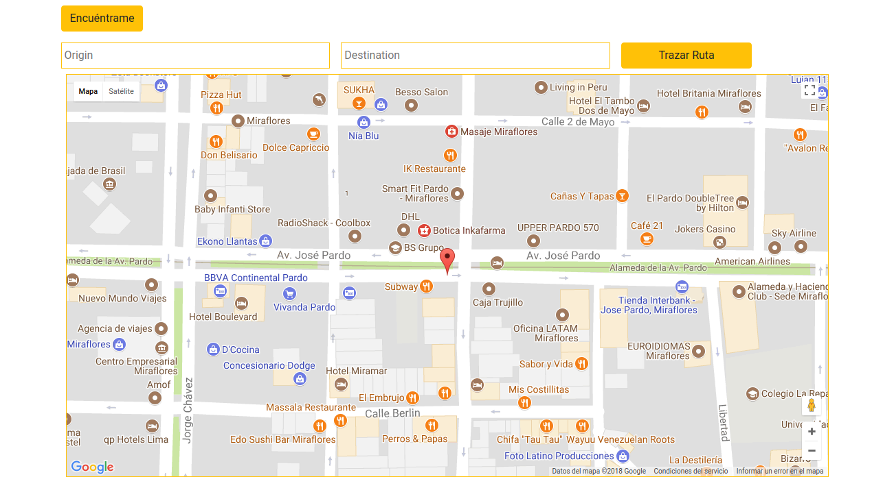
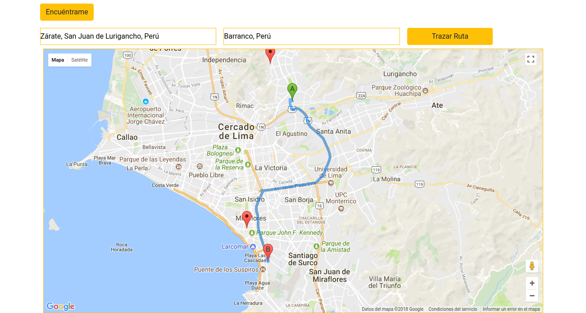
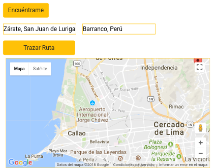
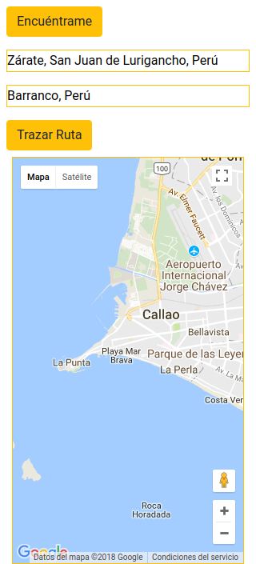

# API Geolocalización (Easy-Vreco)

Gracias a la API de google Maps y la API de geolocalización haremos nuestro proyecto 

Esta aplicación tendrá la funcionalidad de asignar un primer punto (punto de partida) y otro punto (punto de llegada), para luego trazar la ruta entre los puntos ya asignados.

Para este proyecto usamos la API con el plan estándar, para ello debemos obtener una clave de la API configurada en: https://developers.google.com/maps/documentation/javascript/get-api-key

### Pantallazos de nuestro producto
Ubicación inicial o de referencia 

Trazando la ruta de un punto inicial hasta el punto de destino

### Vista responsive
Vista Horizontal

Vista Vertical

### Tecnologia utilizada:
* Bootstrap v4.0
* HTLM 5
* CSS 3
* API google maps
* Vanilla en Es6

### Colaboradores:
* ***Jackeline Gessenia Canales***
* ***Kamaly Zapana***